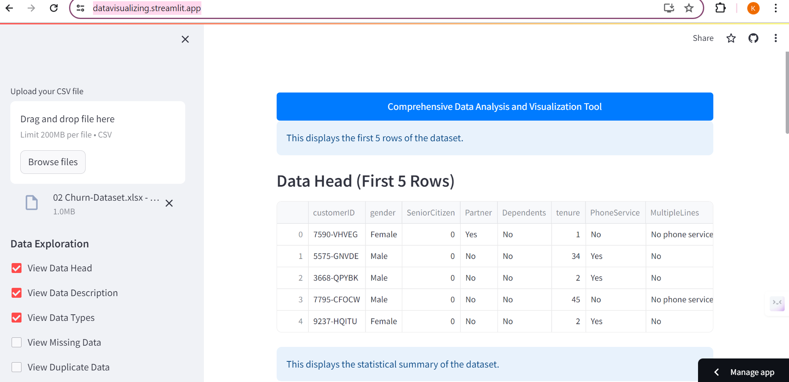
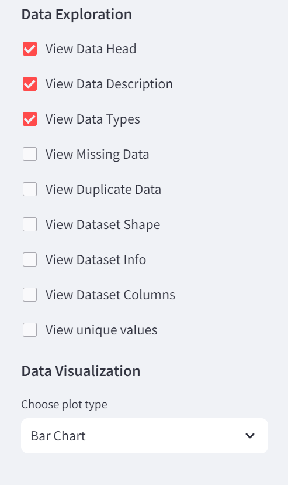
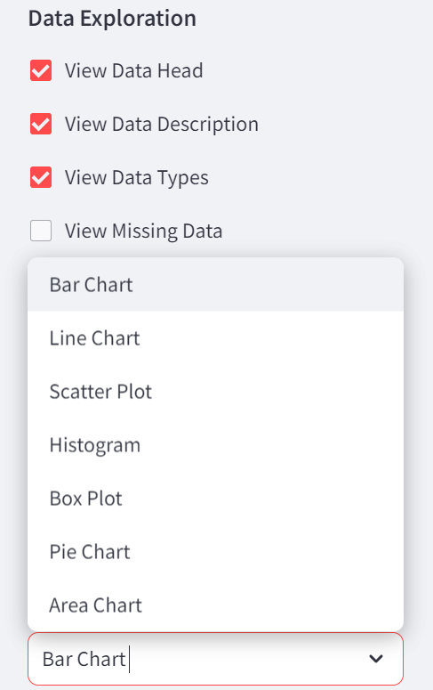

`# Comprehensive Data Analysis and Visualization Tool

This Streamlit application provides a user-friendly interface for analyzing and visualizing datasets. Users can upload their CSV files and explore various aspects of the data, including statistical summaries, data types, missing values, duplicates, and more. Additionally, the tool offers a wide range of plot types for data visualization, such as bar charts, line charts, scatter plots, histograms, box plots, pie charts, and area charts.

## Features

- **Data Exploration**:
 - View data head: Display the first few rows of the dataset.
 - View data description: Show statistical summary of the dataset.
 - View data types: Display data types of each column.
 - View missing data: Identify missing values in the dataset.
 - View duplicate data: Check for duplicate rows.
 - View dataset shape: Display the number of rows and columns.
 - View dataset info: Show information about the dataset.
 - View dataset columns: Display the list of column names.
 - View unique values: Check for duplicate values in each column.

- **Data Visualization**:
 - Choose from a variety of plot types: Bar Chart, Line Chart, Scatter Plot, Histogram, Box Plot, Pie Chart, Area Chart.
 - Select X-axis and Y-axis variables for customized visualizations.
 - Generate interactive plots to explore data patterns and relationships.

## Usage

1. Visit the deployed site: [Comprehensive Data Analysis and Visualization Tool](https://datavisualizing.streamlit.app/)
2. Upload your CSV file using the file uploader on the sidebar.
3. Explore the data using the various options provided in the sidebar for data exploration and visualization.
4. Select plot type, X-axis, and optionally Y-axis variables to generate customized plots.
5. Interact with the plots to gain insights into your data.

## Installation

To run this application locally, follow these steps:

1. Clone this repository:`

git clone <repository_url>

cssCopy code

 `2. Navigate to the project directory:`

cd <project_directory>

markdownCopy code

 `3. Install the required dependencies:`

pip install -r requirements.txt

markdownCopy code

 `4. Run the Streamlit app:`

streamlit run app.py

csharpCopy code

 `5. Access the app in your web browser at `http://localhost:8501`.

## Contributing

Contributions are welcome! If you have suggestions for new features, improvements, or bug fixes, please open an issue or submit a pull request.

## License

This project is licensed under the [MIT License](LICENSE).`
